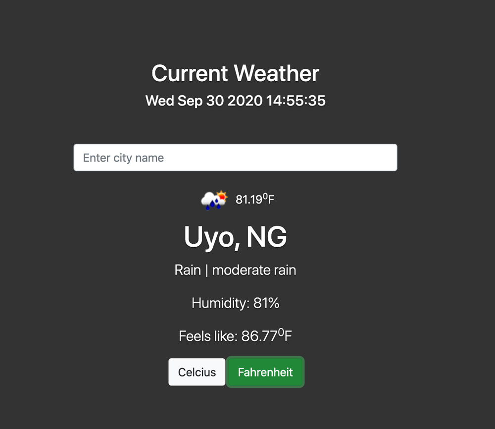

# Weather App

In this project, I created a weather forecast site using the open map weather API.
I got comfortable consuming the API using Async/Await to work with promises using the `fetch` function.



## Built With

- HTML
- JavaScript
- Webpack
- BootStrap
- OpenMapAPI

## Live Demo
[Live Demo Link](https://acushlakoncept.github.io/todo/)


## Getting Started

To get a local copy of the repository please run the following commands on your terminal:

```bash
$ cd <folder>
$ git clone https://github.com/acushlakoncept/weather-app.git
$ cd todo
$ npm install
$ npm run start
```

## Author

**Uduak Essien**

- Github: [@acushlakoncept](https://github.com/acushlakoncept/)
- Twitter: [@acushlakoncept](https://twitter.com/acushlakoncept)
- Linkedin: [acushlakoncept](https://www.linkedin.com/in/acushlakoncept/)


## 🤝 Contributing

Contributions, issues and feature requests are welcome!

Feel free to check the [issues page](https://github.com/acushlakoncept/weather-app/issues).

## Show your support

Give a ⭐️ if you like this project!